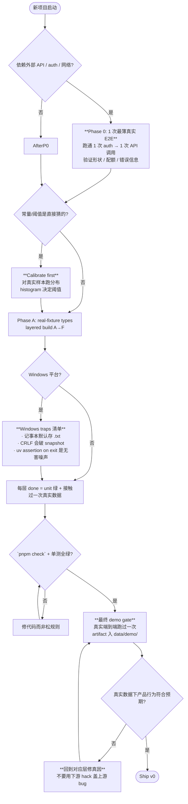

# Retrospective 001 — zhihu-radar v0

**Window:** 2026-04-22 → 2026-05-01
**Outcome:** Phase A→F shipped, 118 tests + `pnpm check` green. **Real
end-to-end blocked at the first attempt** by two issues — one external
(Anthropic credit balance), one a real product bug
(`MAX_ANSWER_AGE_DAYS=365` rejects ~80% of evergreen 知乎 content). The
project is being terminated at v0; this doc is the carry-forward.

> **One-liner for next-you:** Unit tests being green does not mean the
> product is right. **Phase 0 must include one ugly real end-to-end
> before any architectural work** — it's the only place the assumptions
> you don't know you're making get caught.

---

## What got built

- 4-verb CLI: `scrape | analyze | report | draft`
- 7-layer architecture (`types → config → {sources, processors, validators, outputs} → runtime`), enforced mechanically by dependency-cruiser
- 4 ADRs (002 prompt-caching, 003 知乎 API path, 004 signal-source split)
- 5 narrow-scope subagents (`harness-guardian`, `layer-sentinel`,
  `type-carver`, `test-scribe`, `adr-drafter`)
- 118 tests across 12 files; real 知乎 fixture pinned in
  `tests/fixtures/zhihu/`
- Two Claude-backed processors with byte-stable cache prefixes (ADR 002
  invariant pinned by tests on both)

## What worked — keep doing this

The pieces below earned their keep over six phases and multiple sessions.
Default to using them again.

1. **Layered architecture + mechanical depcruise rules with `comment`
   fields explaining *why* each rule exists.** Six phases, zero layering
   violations. Rules taught the next agent what to fix.
2. **ADR-first decisions.** Every non-trivial call landed in
   `docs/decisions/` *before* code. Three months later you can read why,
   not just what.
3. **Exec plan as durable state** (`docs/exec-plans/active/...`).
   Session-local Plan/Todo dies with the session; the file does not.
   Multiple agents resumed cleanly because of this.
4. **Subagents with hard-coded scope and refusal**. `harness-guardian`
   never edits, `layer-sentinel` is read-only, `test-scribe` writes only
   to `tests/`. Narrow surface = no scope creep.
5. **`pnpm check` as the single gate.** tsc + eslint + depcruise in one
   command. No "almost green" allowed.
6. **`now: Date` injected as a parameter** to every layer that might
   read the wall clock. Tests pin time, processors stay pure.
7. **Real-fixture-driven types.** `type-carver` carved
   `ZhihuAnswerWire` / `ZhihuCommentWire` from a real captured response,
   not from imagination. Saved a refactor.
8. **Per-row file granularity** (`processed/<qid>-<aid>.json`,
   `drafts/draft-<qid>-<date>.md`). Resume-on-crash and single-row re-run
   are `rm` + re-run.
9. **Snapshots as committed `.expected.md` files** (not vitest's
   serialised snapshots). The reviewer can `cat` them.
10. **Stable-prefix byte-identity test** for both Claude processors.
    Mechanically pins the ADR 002 cache invariant — leak any per-call
    value into the cached prefix and the test goes red immediately.

## Pitfall flowchart — read before starting the next project

## 这次具体踩到的坑（按发现顺序，可以 grep）

| # | 坑                                                                | 真因                                                | 下次怎么避                                                 |
| - | ----------------------------------------------------------------- | --------------------------------------------------- | ---------------------------------------------------------- |
| 1 | `pnpm dev scrape` 第一次跑就 403                                  | `ZHIHU_COOKIE` 没设；没 auth 预检                   | Phase 0 thin E2E 第一动作就是 auth 验证                    |
| 2 | `MAX_ANSWER_AGE_DAYS=365` 把 4/5 优质答案 reject                  | 阈值是猜的，单测怎么写都测不出来                    | `pnpm dev calibrate` 出 age/upvote 直方图，再定常量        |
| 3 | Anthropic credit-balance 错误只在 batch 中段才暴露                | 没有预算预检                                        | `pnpm dev plan` 先打印"将调 N 次 ≈ \$X，按 enter 确认"     |
| 4 | 用户照 `env.ts` 错误信息建了 `.env`，但代码不自动加载             | error message 撒谎（没接 dotenv）                   | 要么加最小 dotenv loader，要么改文案为 "export it"         |
| 5 | Windows 记事本默认存成 `.env.txt`                                 | 平台默认行为                                        | `docs/setup.md` 写明「用 VSCode/Notepad++ 或 echo 单引号」 |
| 6 | session 间 bash env 不持久（agent 工具调用）                      | 工具特性                                            | 每次调用 inline `set -a; source .env; set +a; <cmd>`       |
| 7 | mock 单测拿到 100% 信心，但真 Claude 调用从未发生过               | 测试栈底是假的                                      | smoke test 阶段：1 次真调用 gated by `RUN_LIVE=1`          |
| 8 | "Phase F done" 定义在 fixture/unit 上，不在真实数据               | 把"代码正确"等同于"产品 work"                       | done = 真实数据 demo 过；artifact 入 `data/demo/`          |

## 下个项目的进步空间（具体动作，不空话）

### A. 流程层

- **Phase 0：1 次真实调用预检**。在 `types/` 任何字段被写下之前，手跑一次「最薄链路」：能 auth 吗？能调 API 吗？返回形状跟你直觉一致吗？这一步暴露所有不该假设的假设。
- **Calibration 优先于 thresholds**。任何「<5 行字符」「>365 天」这类常量，先对真实样本跑一遍分布。`MAX_ANSWER_AGE_DAYS=365` 是产品级 bug —— 单测无能为力。
- **Done 必须包含一个 demo 步**。当前 plan 的 done = `pnpm check 绿 + tests 绿 + fixture 跑通`。下次加：「对一个真实 input 端到端跑通，artifact 入 `data/demo/`」。

### B. 工具/工程层

- **`pnpm dev doctor`**：跑前预检 cookie 有效性、API key 有效性、磁盘空间、网络。一个命令把外部依赖问题摊到 0 秒发现。
- **`pnpm dev plan`**：在 analyze/draft 实际调 API 前打印 "将调 N 次 Claude，预计 \$X，按 enter 确认"。防止额度耗光中段失败。
- **`pnpm dev calibrate`**：对 raw/ 数据打印 age / upvote / length 直方图，便于人工调阈值。
- **修 `env.ts` 错误信息**：要么加 dotenv（破 CLAUDE.md rule 4 — 需要 ADR），要么把 "Add it to .env" 改成 "export it in your shell before running"。当前文案撒谎。
- **新增 `docs/setup.md`**：Windows-first，cookie 怎么取（截图）、.env 怎么建（避免 `.txt` 陷阱）、API key 在哪买、第一次跑 doctor 的预期输出。这次手把手 4 轮对话压缩成 1 页文档。

### C. 测试策略层

- **Mock 是地板，不是天花板**。Mock = 代码逻辑对；真调用 smoke = 产品对外接得上。两层都要，缺谁都是假信心。
- **Contract test 对真实样本**：每个 `sources/` 有 1 个 nightly 真调用，gated by `RUN_LIVE=1`，每周或临 release 跑。
- **加 calibration test**：对真实 fixture 计算阈值会 reject 多少行，超过 X% 就红灯 —— 把 "阈值脱离真实分布" 变成机械可见。

### D. 心理/认知层

- **"这数字哪来的？谁见过真实数据支持它？"** 每次写常量、每次写 `if`，问一遍。没人 → 标 calibration 待办，不直接落代码。
- **早暴露 vs 晚暴露**：layer-first（这次的策略）偏后暴露假设；vertical-slice 偏早。下次默认 **先一刀 vertical slice**（即上面的 Phase 0），再回去补层。
- **外部依赖（API quota / auth / 网络）是产品本体**，不是 "基础设施细节"。把它们放进计划的 *第一* 阶段，不是 deployment 章。

## 流程图省流版（如果只记三句）

1. **Phase 0 = 1 次真实端到端**，先于一切。
2. **任何阈值常量 = 先 calibrate，后落代码。**
3. **Done gate 包含一次真实 demo，不只 unit 绿。**

## 下一项目的 starter checklist

复用这套架构开新项目时，照单走：

- [ ] 取一个真实 input，手跑一次完整链路（即使靠粘贴/curl）
- [ ] 把 auth/quota/网络问题在 Phase 0 全暴露
- [ ] 对 1 批真实样本跑分布，再定阈值常量
- [ ] 起 `docs/exec-plans/active/001-...md` durable plan
- [ ] 起 layered 目录 + depcruise 规则 + 每条规则带 `comment`
- [ ] 起 `pnpm check` = tsc + lint + depcruise，作为 done gate 的下界
- [ ] 写 `docs/setup.md`（Windows traps + .env + auth）
- [ ] 写 `pnpm dev doctor` + `pnpm dev plan`
- [ ] Done gate 里加一条 "real-data demo artifact 入 `data/demo/`"

---

## Cross-reference

- 具体技术 gotcha（CRLF、Anthropic 余额错误、记事本 .txt、cookie 取法）落在
  `docs/agent-learnings.md`，按日期可查。
- 架构原理见 `docs/architecture.md`。
- 决策记录见 `docs/decisions/`。
